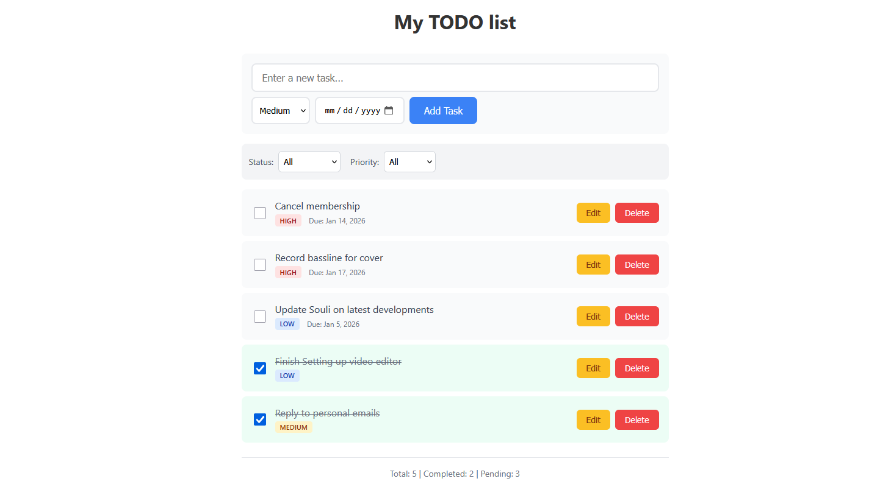

# Task API

Web app built with **C# (.NET 8)** backend and **Angular** frontend.  
Currently supports user tasks, task priorities, due dates, and completion tracking. Includes EF Core migrations, Swagger API, and unit tests.

---



## Features

- Task fields:
  - Description
  - Priority (Low, Medium, High)
  - Due date
  - Completion status
- Filter tasks by status and priority
- Angular frontend
- Swagger UI for API 
- Unit tests for backend endpoints

## To be added

- User authentication with JWT
- Optional guest mode (use the app without registering)
- Timestamps
- Overdue tasks
- Sorting

---

## Technologies

- **Backend:** C#, ASP.NET Core 8, Entity Framework Core 8, SQLite
- **Frontend:** Angular (latest stable), TypeScript
- **Testing:** xUnit
- **Other:** Swagger/OpenAPI, Git


---

## Setup Instructions

### Backend

1. Navigate to backend folder:

```bash
cd backend/TaskAPI
```
2. Restore packages:

```bash
dotnet restore
```

3. Apply migrations and create database:

```bash
dotnet ef database update
```
    
4. Run the API:

```bash
dotnet run
```

Swagger UI available at https://localhost:<port>/swagger

### Frontend

1. Navigate to frontend folder:

```bash
cd frontend/task-ui
```

2. Install dependencies:

```bash
npm install
```

3. Run Angular dev server:

```bash
ng serve
```

App available at http://localhost:4200

### Running Tests

```bash
cd backend/TaskAPI.Tests
dotnet test
```